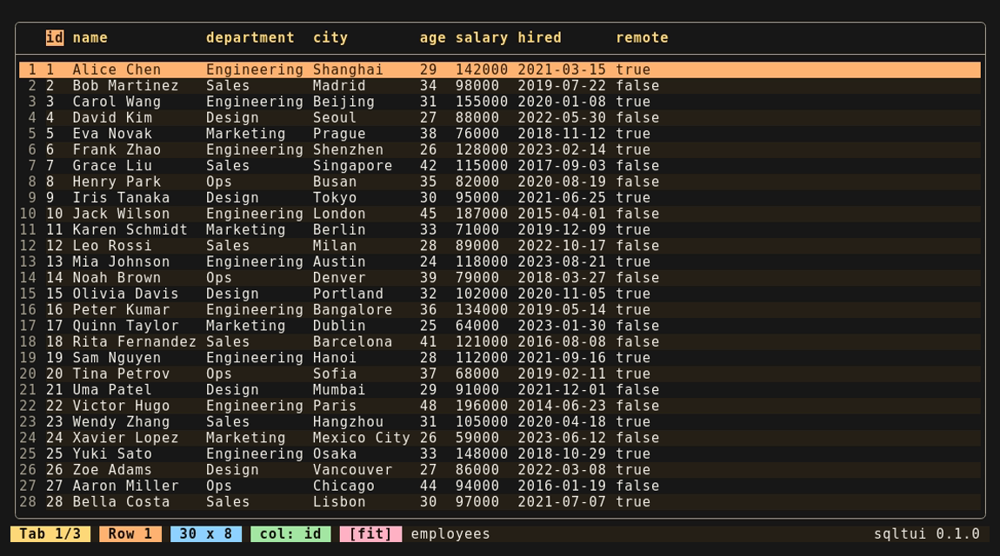
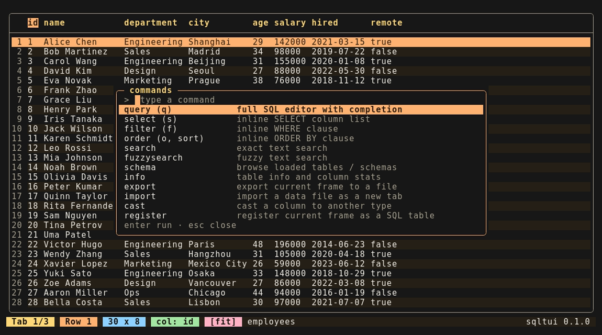
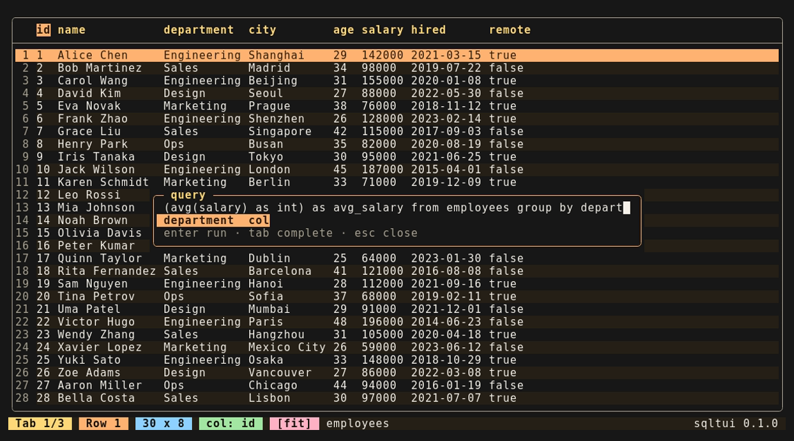
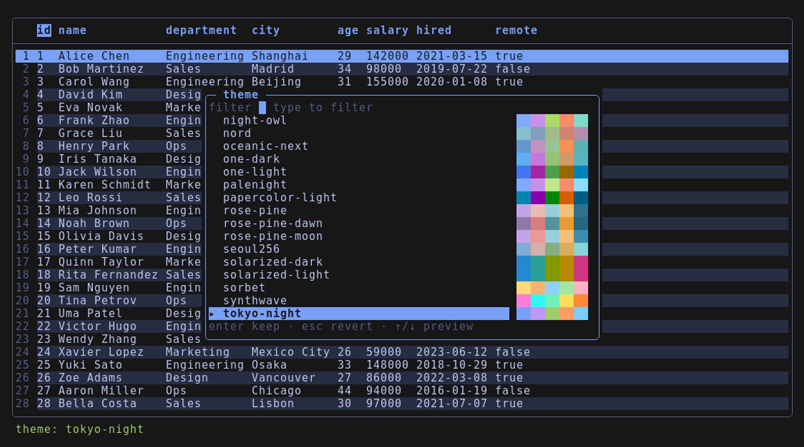
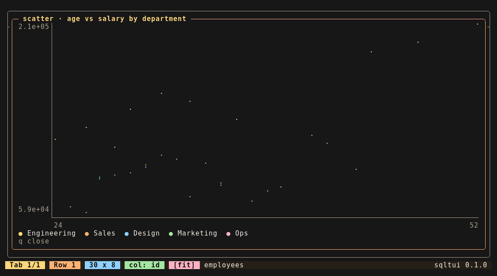
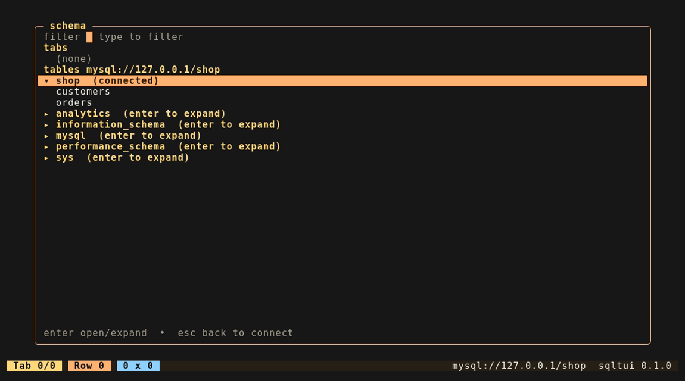

# sqltui

A lightweight terminal UI for viewing and querying tabular data — data files
and live databases — with SQL, fuzzy search, plotting and theming built in.
Written in Go on top of Bubble Tea v2.


## Highlights

- **Open anything tabular** — csv, tsv, dsv, json, jsonl, parquet, excel,
  sqlite, fwf, logfmt, markdown, html; stdin (`-`) and http(s) URLs too
- **SQL everywhere** — an embedded in-memory SQL engine over loaded files, or
  live statements against MySQL / PostgreSQL / SQLite / Redis
- **Tabs + frame stack** — every table is a tab; every operation (filter,
  sort, query, search, cast) layers a new frame you can pop off with `q`
- **Fuzzy & exact search** with live preview as you type — and every picker
  (schema browser, columns, themes, redis keys) is type-to-filter
- **Command palette** with fuzzy matching and inline shortcuts (`:f price > 3`)
- **Context-aware SQL completion** — tables after `FROM`, columns after
  `WHERE`, `alias.` resolution, functions, case-following
- **Histogram & scatter plots** rendered right in the terminal
- **Export** to csv, tsv, json, jsonl, parquet, markdown
- **Copy & paste** — `y`/`Y` copy cell/row over OSC52 (works through SSH),
  bracketed paste into any input, terminal text selection stays untouched
- **40+ built-in themes** with live preview (default: `sorbet`, a warm
  pastel scheme), on a transparent background that blends with your
  terminal, plus `$EDITOR` round-trip editing

## Screenshots

| | |
|:--:|:--:|
|  <br> *Table view — stripes, gutter, status tags* |  <br> *Command palette (`:`)* |
|  <br> *SQL editor with autocompletion* |  <br> *Theme selector with live preview* |
|  <br> *Histogram (`:histogram`)* |  <br> *Scatter plot grouped by column* |

## Install

```sh
go build -o sqltui .
```

Try it right away with the bundled sample data:

```sh
./sqltui examples/employees.csv examples/demo.db
```

## Usage

### File mode

```sh
sqltui data.csv                     # open one file
sqltui a.csv b.parquet c.xlsx       # multiple files -> multiple tabs
sqltui database.db                  # every sqlite table becomes a tab
cat data.csv | sqltui -             # stdin
sqltui https://example.com/x.csv    # remote file
sqltui data.txt -f csv              # override format detection
sqltui --multiparts p1.csv p2.csv   # concatenate parts vertically
```

Parsing flags: `--separator`, `--quote-char`, `--no-header`,
`--ignore-errors`, `--infer-schema no|fast|safe`, `--infer-types`,
`--truncate-ragged-lines`, `--widths`, `--separator-length`,
`--no-flexible-width`, `--sqlite-key`.

### Database mode

Database mode is for server databases that need connection credentials.
SQLite databases are just files — open them directly in file mode
(`sqltui app.db`), no subcommand needed.

| Database   | Command           | Driver                                                     |
| ---------- | ----------------- | ---------------------------------------------------------- |
| MySQL      | `sqltui mysql`    | [go-sql-driver/mysql](https://github.com/go-sql-driver/mysql) |
| PostgreSQL | `sqltui postgres` | [jackc/pgx](https://github.com/jackc/pgx)                   |
| Redis      | `sqltui redis`    | [redis/go-redis](https://github.com/redis/go-redis)         |

A connection form opens first (prefilled from the config file): `enter`
connects, `tab`/arrows move between fields, `ctrl+s` saves, `esc` quits.
After connecting, the schema browser opens with the connected database
expanded and the others collapsed (lazy-loaded on `enter`); type to filter
tables. `enter` loads a table into a tab, and `:query` runs statements
against the live connection.

Database mode is organized as a stack of full-screen pages — connection
form, schema browser, table — and `esc` always goes back one page: from a
table it first pops applied frames, then returns to the schema browser;
from the browser it returns to the connection form; from the form it exits.
`q` in the browser jumps straight back to the open table instead.



In Redis mode a key browser (grouped by type) replaces the schema browser —
including in the `esc` chain above — and the query prompt executes raw
commands with inline argument hints and completion for 230+ commands.

## Keybindings

| Key | Action |
|---|---|
| `k`/`↑`, `j`/`↓` | move up / down |
| `h`/`←`, `l`/`→` | move column cursor (both column modes) |
| `g`/`home`, `G`/`end` | first / last row |
| `ctrl+u` / `ctrl+d` | half page up / down |
| `pgup`/`ctrl+b`, `pgdown`/`ctrl+f` | page up / down |
| `_` / `$` | first / last column |
| `enter` | open row detail sheet |
| `w` | toggle fit / wide column mode (auto-picked per table) |
| `y` / `Y` | copy current cell / current row |
| `i` | table info |
| `R` | random row |
| `1`-`9` | go to row |
| `/` , `s` | fuzzy / exact search |
| `:` | command palette |
| `t` | tab switcher |
| `H`/`shift+←`, `L`/`shift+→` | previous / next tab |
| `q` | pop frame / close tab / back |
| `esc` | back one level (never closes a tab or quits) |
| `Q` | quit |
| `F1` / `?` | help |

In the sheet view: `j`/`k` (or `shift+j`/`shift+k`) scroll, `c` copies the
row, `q`/`esc` return to the table.

## Commands

Open the palette with `:` and type. Short aliases take the rest of the line
as an argument (`:f age > 30` filters immediately).

| Command | Alias | Effect |
|---|---|---|
| `query` | `q` | full SQL editor with autocompletion |
| `select` | `s` | inline column selection |
| `filter` | `f` | inline WHERE clause |
| `order` | `o`, `sort` | inline ORDER BY |
| `search` / `fuzzysearch` | | exact / fuzzy search |
| `schema` | | browse open tabs and live tables |
| `info` | | table schema and stats |
| `export` / `import` | | file export / import wizards |
| `cast` | | change a column's type |
| `register` | | name the current frame for SQL |
| `histogram` / `scatterplot` | | terminal plots |
| `edit` | | edit the table in `$EDITOR` |
| `theme` | | theme selector with live preview |
| `toggleborders` / `togglerownumbers` | | view toggles |
| `reset` | | back to the base frame |
| `reloadconfig` | | reload the config file |

## SQL

In file mode every loaded table is queryable by its tab name and the current
frame is always available as `_`:

```sql
select department, count(*) as headcount, cast(avg(salary) as int) as avg_pay
from employees group by department order by avg_pay desc
```

Full query results open in a new tab; inline `select`/`filter`/`order`
results stack onto the current tab (pop with `q`).

## Configuration

`~/.config/sqltui/config.yaml` stores connection settings per engine plus UI
preferences:

```yaml
mysql:
  userName: root
  password: "123456"
  host: 127.0.0.1
  port: "3306"
  dbName: test_db
ui:
  theme: aurora
  showBorders: true
  showRowNumbers: true
```

A `config.json` left over from an older version is migrated to `config.yaml`
automatically on first start (the JSON file is kept, but no longer used).

Logs go to `~/.config/sqltui/sqltui.log`.

## Tips

- The column cursor (`h`/`l`) works in both column modes: the header
  highlights it, the status bar `col:` tag tracks it, `y` copies the cell
  under it, and wide mode scrolls to keep it visible.
- Every filter, sort, query or search layers a frame onto the tab's stack;
  the breadcrumb in the status bar shows the chain. `q` pops one layer,
  `esc` steps back too, and `:reset` jumps straight to the base table.
- In SQL, `_` always means the current frame; `:register` gives a frame a
  real name so you can join it against other tables.
- `y`/`Y` and the sheet view's `c` copy via OSC52, so the clipboard works
  over SSH. Bracketed paste works in every input, and the mouse is never
  captured — plain terminal text selection keeps working.
- Type to filter in every picker: schema browser, theme selector, column
  pickers, tab switcher, redis keys.
- `1`-`9` opens the go-to-row prompt with that digit prefilled, and `R`
  jumps to a random row.
- The theme selector previews live as you move the highlight — `enter`
  keeps it, `esc` reverts to the previous theme.
