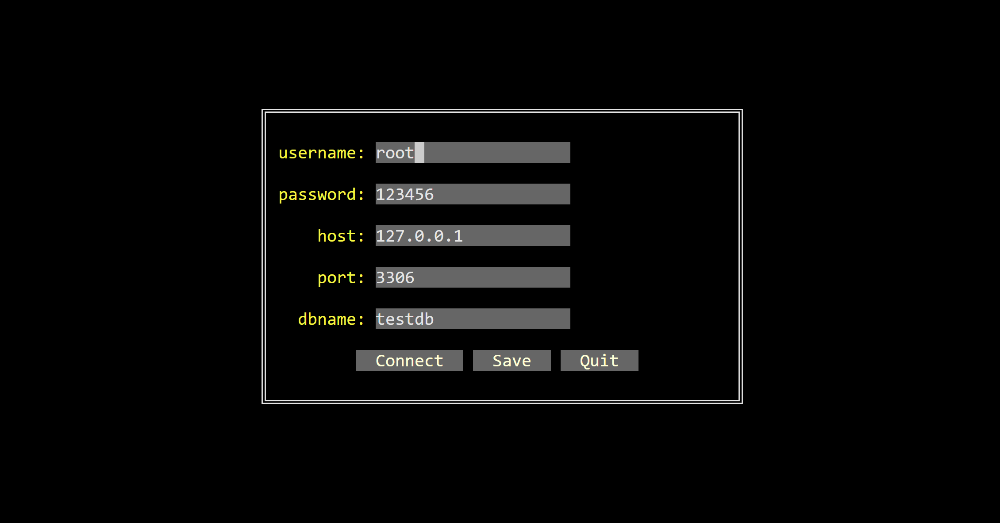
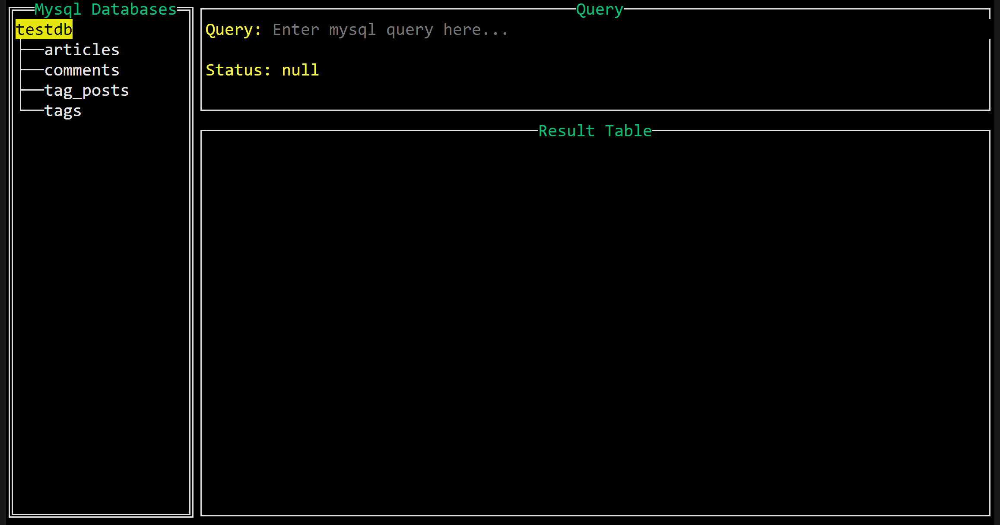
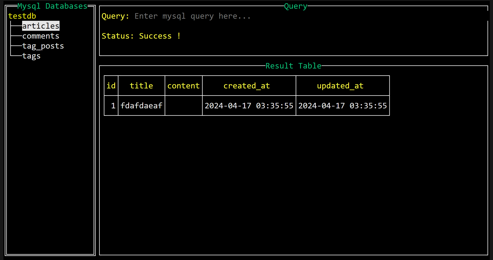
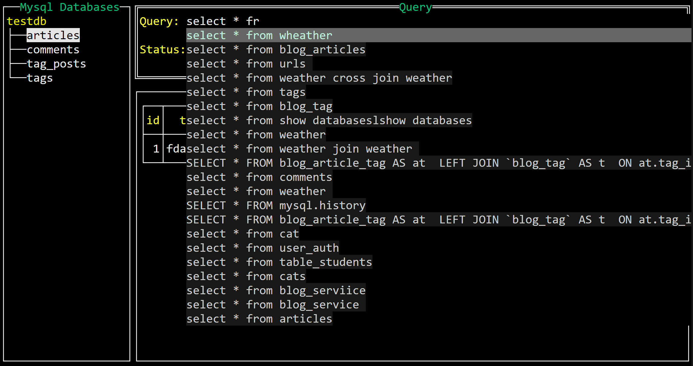
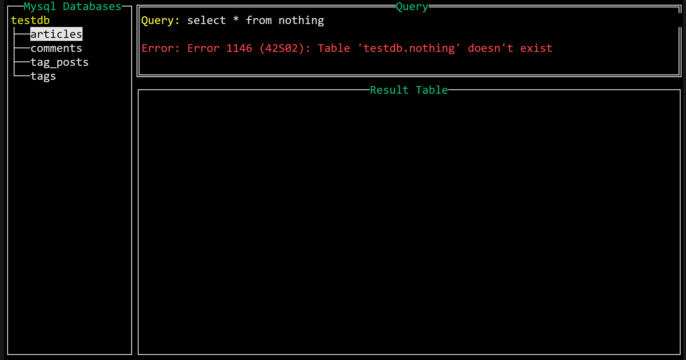
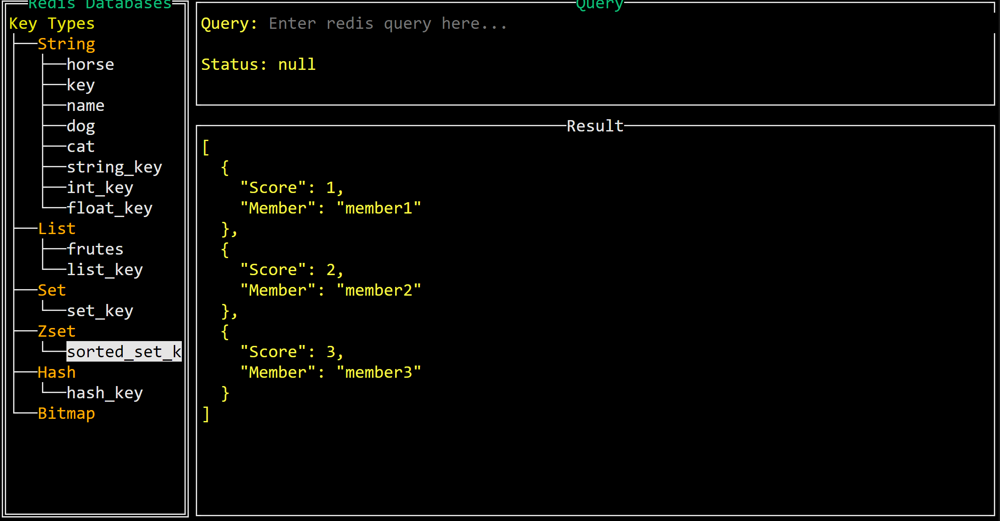
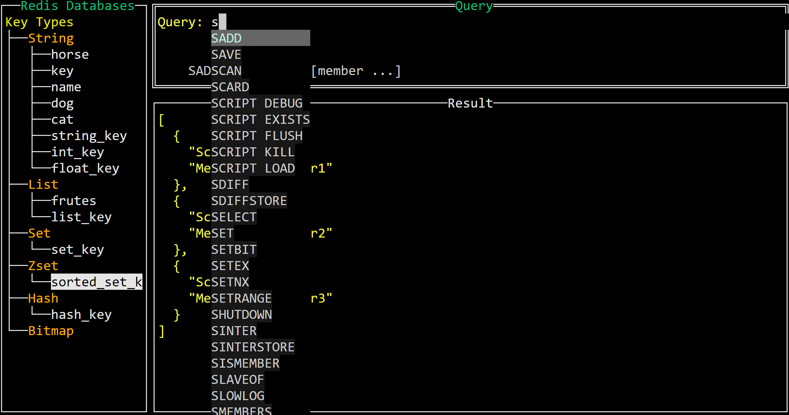
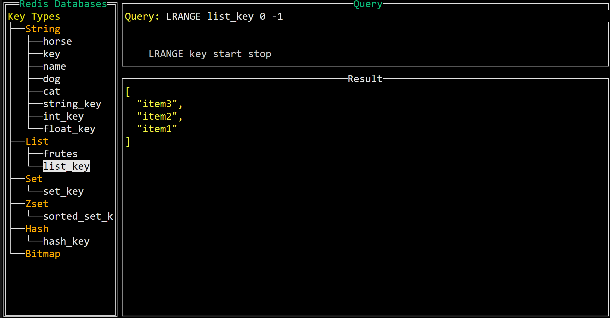

# SQLTUI - A terminal UI to operate sql and nosql databases

sqltui provides a terminal UI to interact with your sql or nosql databases. The aim of this project is to make it easier to navigate, observe and manage your databases in the wild.

Supported databases:

| Database   | Command           | Driver                                                     |
| ---------- | ----------------- | ---------------------------------------------------------- |
| MySQL      | `sqltui mysql`    | [go-sql-driver/mysql](https://github.com/go-sql-driver/mysql) |
| PostgreSQL | `sqltui postgres` | [jackc/pgx](https://github.com/jackc/pgx)                   |
| SQLite     | `sqltui sqlite`   | [modernc.org/sqlite](https://gitlab.com/cznic/sqlite) (pure Go, no cgo) |
| Redis      | `sqltui redis`    | [redis/go-redis](https://github.com/redis/go-redis)         |

# Screenshots
1. mysql login


2. mysql tables tree


3. mysql show records


4. mysql auto complete query


5. mysql show error message


6. redis keys


7. redis result


8. redis auto complete and command tip


# Install
### 1. install with go

```shell
go install github.com/LinPr/sqltui@latest
```

### 2. build from source

```shell
git clone https://github.com/LinPr/sqltui.git
cd sqltui
go build -o sqltui .
```

# Quick start

### help

``` shell
$ sqltui -h

sqltui is a tui tool to operate sql and nosql databases

Usage:
  sqltui [command]

Available Commands:
  completion  Generate the autocompletion script for the specified shell
  help        Help about any command
  mysql       start a mysql tui
  postgres    start a postgresql tui
  redis       start a redis tui
  sqlite      start a sqlite tui

Flags:
  -h, --help   help for sqltui

Use "sqltui [command] --help" for more information about a command.
```

### connect to a database

```shell
$ sqltui mysql      # MySQL
$ sqltui postgres   # PostgreSQL (aliases: pg, postgresql)
$ sqltui sqlite     # SQLite (opens a local database file)
$ sqltui redis      # Redis
```

Each command opens a login page pre-filled from the config file. After a
successful connection the login information is saved automatically.

# Keybindings

### Login page

| Key    | Function                            |
| :----- | ----------------------------------- |
| Tab    | Move to the next form field         |
| Ctrl+S | Save login information to file      |
| Ctrl+C | Quit                                |

### Dashboard (all databases)

| Key           | Function                                  |
| ------------- | ----------------------------------------- |
| Tab           | Switch focus to the next widget           |
| Shift+Tab     | Switch focus to the previous widget       |
| Ctrl+R        | Run the query/command in the query area   |
| Enter         | Select tree node / run query (mysql, redis) |
| Esc           | Back to the login page                    |
| Ctrl+Q        | Quit                                      |

A one-line help bar at the bottom of every dashboard shows the available keys.

# Configuration

Connection settings are stored in `~/.config/sqltui/config.json` (created on
first run, file mode `0600` since passwords are stored in plaintext). Each
database section can also be edited by hand:

```json
{
  "mysql":    { "userName": "root", "password": "...", "host": "127.0.0.1", "port": "3306", "dbName": "test_db" },
  "redis":    { "userName": "", "password": "", "host": "127.0.0.1", "port": "6379", "rdbNum": "0" },
  "sqlite":   { "filePath": "/home/you/.config/sqltui/sqlite.default" },
  "postgres": { "userName": "postgres", "password": "", "host": "127.0.0.1", "port": "5432", "dbName": "postgres", "sslMode": "disable" }
}
```

Logs are written to `~/.config/sqltui/sqltui.log` (truncated automatically
when they grow beyond 1 MB).

# TODO list
1. query history and auto-completion for postgres/sqlite
2. export query results (csv/json)
3. support others...

# References

this project uses two main opensource projects
- [cobra - for building command line interface](https://github.com/spf13/cobra)
- [tview - for building terminal ui interface](https://github.com/rivo/tview)
