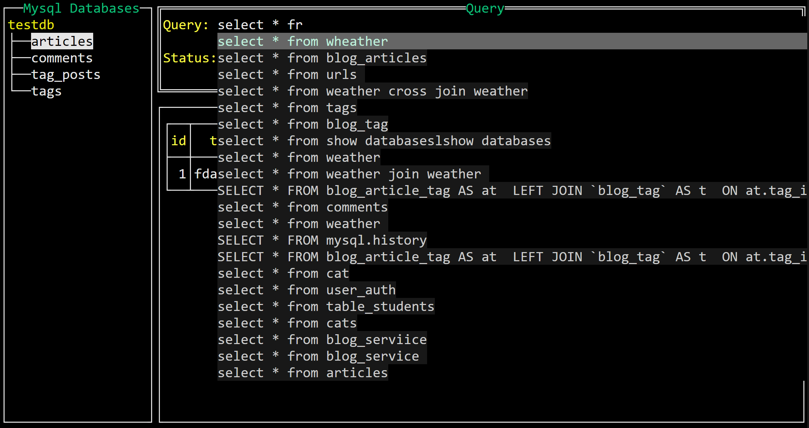

# SQLTUI - A terminal UI to operate sql and nosql databases

sqltui provides a terminal UI to interact with your sql or nosql databases. The aim of this project is to make it easier to navigate, observe and manage your databases in the wild. 

# Screenshots
1. mysql login


2. mysql tables tree


3. mysql show records


4. mysql auto complete query


5. msql show error message


6. redis keys 


7. redis result


8. redis auto complete and command tip


# install
### 1. install with go

```shell
go install github.com/LinPr/sqltui@latest
```


# quick start


### help 

``` shell
$ sqltui -h

sqltui is a tui tool to operate sql and nosql databases

Usage:
  sqltui [command]

Available Commands:
  completion  Generate the autocompletion script for the specified shell
  help        Help about any command
  mysql       start a mysql tui
  redis       start a redis tui

Flags:
  -h, --help   help for sqltui

Use "sqltui [command] --help" for more information about a command.
```

### connect to mysql

```shel
$ sqltui mysql
```

### connect to redis

```shell
$ sqltui redis
```

# Keybindings

### Login

| kEY      | fUNCTION                                                |
| :------- | ------------------------------------------------------- |
| Enter    | Confirm Login Information                               |
| Ctrl+s   | Save Login Information to file (defeault to  ~/.sqltui) |
| Ctrl+c   | Quit                                                    |
| Tab      | Switch to next object                                   |
| Ctrl+Tab | Switch to previous object                               |


### Mysql Dashboard

| kEY   | fUNCTION            |
| ----- | ------------------- |
| Enter | Select Tree Node    |
| Tab   | Switch Widget Focus |


# TODO list
1. supprt sqlight(current working on)
2. support others...

# references

this project used two main opensorce projects
- [cobra - for building command line interface](https://github.com/spf13/cobra)
- [tview - for building terminal ui interface](https://github.com/rivo/tview)